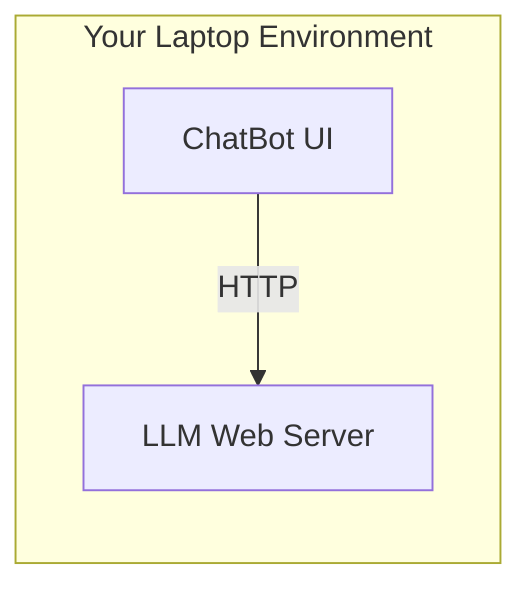

# local-chatgpt-app

A complete LLM ChatBot UI and server, all running on your laptop (tested on macOS):



## Goals

 - Run a ChatGPT-like LLM locally on my macOS (using [llama-cpp-python](https://github.com/abetlen/llama-cpp-python))
 - Run a ChatGPT-like UI/app locally on my macOS (using [chainlit](https://github.com/Chainlit/chainlit))

## Setup

This loosely follows the setup steps from https://llama-cpp-python.readthedocs.io/en/latest/install/macos/.

### Python Version

This code has been tested on Python version 3.9.16. [Pyenv](https://github.com/pyenv/pyenv) is a great way to
install Python.

### Python Library Installation

Set up a virtual environment and install Python requirements:

```
python -m venv venv && source venv/bin/activate
pip install -r requirements.txt
```

### Model Download

Model download command:
```
huggingface-cli download \
    TheBloke/Llama-2-7B-Chat-GGUF \
    llama-2-7b-chat.Q5_K_M.gguf \
    --local-dir ./models/llama-7b-chat/ \
    --local-dir-use-symlinks False
```

This file format (GGUF) is compatible for running LLMs on macOS.
To use a different model, make sure to update the `run-server.sh` script's
`MODEL` variable after download.

## Usage

In one terminal, activate the virtualenv and run the model server with:
```
./run-server.sh
```

This will run the Llama 7B chat model server (by default on port 8000).

In another terminal, activate the virtualenv and run the UI with:
```
./run-ui.sh
```

This will open a ChatGPT-like UI in your browser using Chainlit (by default on port 8001).

## Troubleshooting

### Llama Library File Override

It may be necessary to run the `llama_cpp.server` with an override configured for `LLAMA_CPP_LIB`
to the path of the `.dylib` file created in the environment by the `llama-cpp-python` package.
This can be found by running `find /path/to/venv -name '*.dylib'` in your venv (or Conda env).
Attempting to build the llama C++ from scratch using https://github.com/ggerganov/llama.cpp resulted in
a segmentation fault for me when attempting to run the `llama_cpp.server` module, so the library override
using a pre-built library file seems to be more stable.
